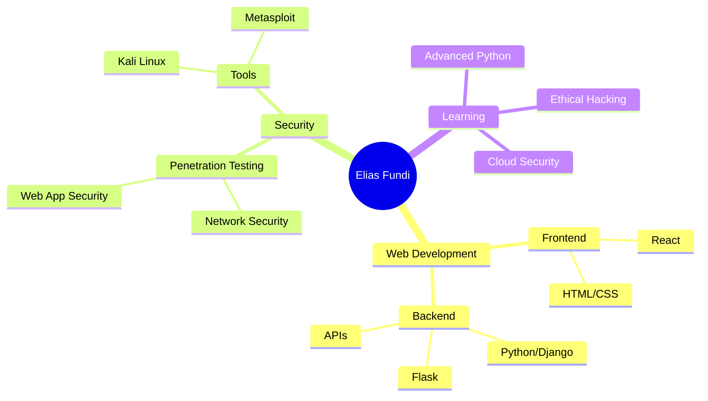

<div align="center">
  
</div>

<div align="center">
  
  
</div>

---

## 🚀 About Me

```python
class Developer:
    def __init__(self):
        self.name = "Elias Fundi"
        self.role = "Web Developer & Security Enthusiast"
        self.language_spoken = ["en_US", "sw_TZ"]
        self.currently_learning = ["Penetration Testing", "Advanced Python"]

    def say_hi(self):
        print("Thanks for dropping by! Let's build something amazing together!")

me = Developer()
me.say_hi()
```

- 🔭 I'm passionate about **Web Development** and **Application Security**
- 🌱 Currently diving deep into **Penetration Testing** and **Python**
- 💞️ Looking to collaborate on **Web Projects**, **Python Applications**, and **Security Tools**
- 📫 Reach me at: **eliasdavi965@gmail.com**
- ⚡ Fun fact: I love breaking things to understand how they work!

---

## 🛠️ Tech Stack

<div align="center">

### Languages


### Frameworks & Libraries


### Security & Tools


### Development Tools


</div>

---

## 📊 GitHub Statistics

<div align="center">
  
  
</div>

<div align="center">
  
</div>

<div align="center">
  
</div>

---

## 🏆 GitHub Trophies

<div align="center">
  
</div>

---

## 📈 Contribution Activity

<div align="center">
  
</div>

---

## 🎯 Current Focus



---

## 💼 Projects & Contributions

<div align="center">

[](https://github.com/ELIASFUNDI)

</div>

---

## 🤝 Connect With Me

<div align="center">

[](mailto:eliasdavi965@gmail.com)
[](https://github.com/ELIASFUNDI)
[](https://linkedin.com/in/eliasfundi)
[](https://twitter.com/eliasfundi)

</div>

---

## 💡 Random Dev Quote

<div align="center">


</div>

---

<div align="center">

### ✨ Show some ❤️ by starring some of the repositories! ✨


</div>
